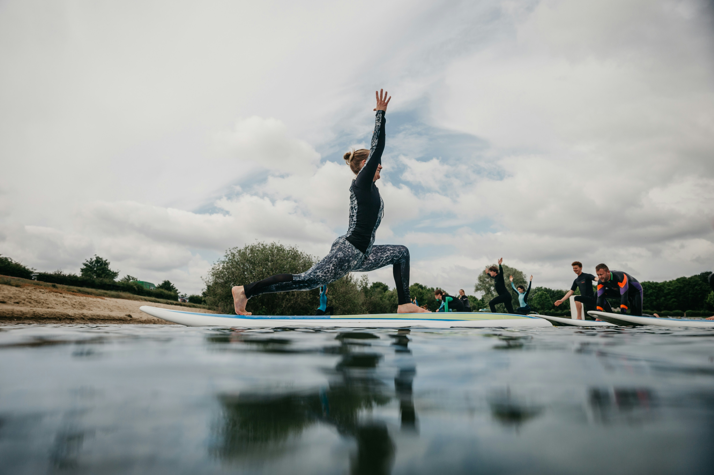

# Stretching for Health and Flexibility

Welcome to **Stretching for Health and Flexibility**! Our course is designed to help you achieve greater flexibility, reduce muscle tension, and enhance overall well-being. Whether you’re a beginner or an experienced stretcher, this course has something for you.

## Why Stretch?

Stretching is crucial for maintaining flexibility and preventing injury. It can help improve posture, reduce stress, and increase your overall range of motion. Our course is structured to guide you through effective stretching routines that fit seamlessly into your lifestyle.

### Course Highlights

- **Comprehensive Lessons**: Step-by-step guides on various stretching techniques.
- **Expert Instruction**: Learn from certified fitness professionals with years of experience.
- **Flexible Scheduling**: Access the course materials anytime, anywhere.
- **Personalized Plans**: Create a stretching routine that suits your individual needs.

## What’s Included?

- **Introduction to Stretching**: Understand the basics and benefits of stretching.
- **Targeted Stretching Routines**: Focus on specific areas like upper body, lower body, and full-body stretches.
- **Advanced Techniques**: Learn dynamic and partner stretches for deeper flexibility.
- **Tips & Tricks**: Strategies for maintaining flexibility and preventing injuries.

## Enroll Now

Ready to transform your flexibility and overall health? [Sign up today](#) and get instant access to all course materials!

### Contact Us

Have questions or need more information? [Contact us](mailto:youremail@example.com) or follow us on [social media](#) for the latest updates and tips.

---

**© 2024 Stretching for Health and Flexibility.** All rights reserved.

[Privacy Policy](#) | [Terms of Service](#)
